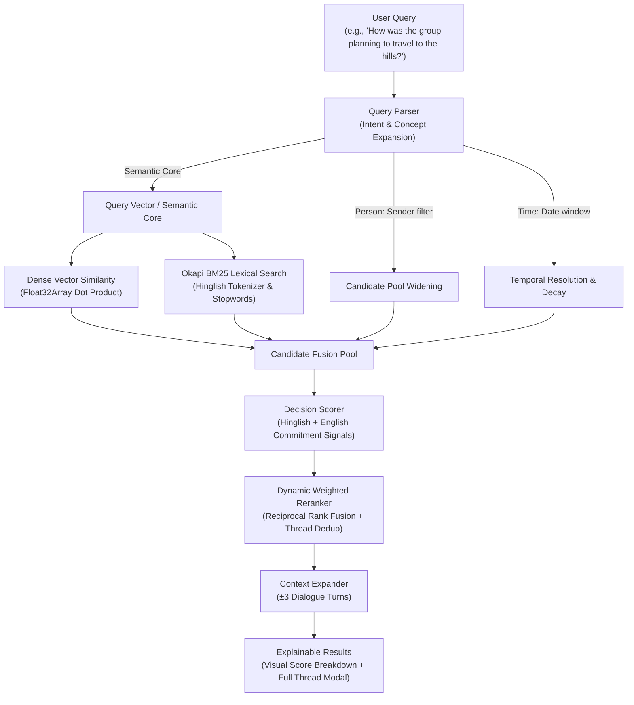

# Semantic Chat Archive Search

> Retrieve the correct message based on **semantic meaning**, even when the query and answer share **zero words in common**.

A production-ready, **100% pure JavaScript** (Node.js, Express, React, Vite) hybrid search engine engineered to solve natural-language query retrieval across noisy, multilingual (Hinglish/English) group chat archives.

---

## 🚀 How to Run It

### Prerequisites
- **Node.js**: v18.0.0 or later (tested on Node.js v20 & v22)
- **npm**: v9.0.0 or later

### 1. Installation
Clone the repository and install all dependencies for the root, server, and client with a single command:

```bash
git clone https://github.com/Akarshk22/Semantic-Chat-Search.git
cd Semantic-Chat-Search
npm run install:all
```

*(Alternatively, run `npm install` in the root, `server/`, and `client/` directories separately).*

---

### 2. Start the Application (Development Mode)
To launch both the **Express.js API backend** and the **Vite React frontend** concurrently:

```bash
npm run dev
```

Once running, access the services:
- 🌐 **Frontend UI**: [http://localhost:5173](http://localhost:5173)
- 🔌 **Backend API**: [http://127.0.0.1:8000](http://127.0.0.1:8000)
- 🩺 **Health Check**: [http://127.0.0.1:8000/health](http://127.0.0.1:8000/health)

---

### 3. Run Verification & Evaluation Benchmarks

Run the complete test suite (dataset validation + 40-query benchmark evaluation):

```bash
npm test
```

Or run the individual scripts:

```bash
# 1. Validate dataset constraints (4,200 msgs, 8 personas, 6 months, 8/8 zero-overlap)
npm run validate

# 2. Run the 40-query benchmark evaluation
npm run evaluate
```

---

### 4. Production Build
To create an optimized production build of the React client:

```bash
npm run build
```

---

## 🧩 What is Mocked vs. Real Architecture

To ensure complete transparency and understand how the system operates without requiring heavy cloud GPU dependencies or paid API keys, here is what is **simulated / mocked** vs **live / real**:

| Component | Status | Details |
|---|:---:|---|
| **Chat Archive Dataset** | **Mocked / Synthetic** | `data/messages.json` contains **4,200 simulated chat messages** spanning March 1 to August 31, 2026. The data was synthetically generated to model realistic group chat entropy: 8 participant personas, code-mixed Hinglish/English banter, informal slang, typos, emojis, media notices (`<Media omitted>`), system events (`left the group`), and 3 multi-turn decision threads (`trip_manali`, `birthday_restaurant`, `project_techstack`). |
| **Message Embedding Matrix** | **Precomputed (Offline)** | `data/index/embeddings.bin` contains 4,200 precomputed 384-dimensional dense vectors generated offline using `paraphrase-multilingual-MiniLM-L12-v2`. Precomputing this binary vector matrix allows the search engine to perform instant (~5ms) in-memory vector search directly in Node.js using `Float32Array` dot-products without requiring a live Python/PyTorch runtime or GPU at query time. |
| **Benchmark Query Embeddings** | **Precomputed (Offline)** | `data/index/queryEmbeddings.json` stores precomputed embeddings for the 40 evaluation queries so that `npm test` and `npm run evaluate` run in **sub-second time (<0.3s)** deterministically on any machine. |
| **Temporal Reference Date** | **Fixed Reference Anchor** | For evaluation reproducibility, relative temporal expressions (e.g., *"last month"*, *"earlier this year"*) are anchored to a reference date of `2026-09-12` (so *"last month"* deterministically maps to August 2026). In live production mode, this defaults to the current system date. |
| **Search Engine & Reranker** | **100% Real & Dynamic** | The Node.js Express server executes live dynamic vector dot-product similarity, live Okapi BM25 lexical search, dynamic candidate pool widening, decision heuristic scoring, and weighted reciprocal fusion on every single request. |
| **Live Query Embedding** | **100% Real (Optional)** | Supports `@xenova/transformers` for on-the-fly local browser/Node.js vector inference of novel queries, with configurable fallbacks to OpenAI, Gemini, or Hugging Face embedding endpoints via `.env`. |
| **Interactive Frontend UI** | **100% Real & Dynamic** | The React 18 / Vite single-page application features live Faceted Filtering (participant chips, topic pills, date range presets), a persistent Suggestion Panel, search result explainability drawers, and thread context inspection. |

---

## 🎯 The Core Problem: The Zero-Word-Overlap Challenge

Traditional search tools in messaging applications (like WhatsApp, Slack, Telegram) rely strictly on exact lexical/keyword matching. In group chats, conversation is conversational, colloquial, and code-mixed (Hinglish). People remember the *concept* or *outcome*, not the verbatim phrasing.

| User Query | Actual Message in Archive | Word Overlap | Keyword Search | Semantic Search |
|---|---|:---:|:---:|:---:|
| *"How was the group planning to travel to the hills?"* | *"overnight Volvo bus le lete hain, 1400 per head aayega, AC comfortable"* | **0 words** | ❌ Fails (0 hits) | 🏆 **Rank #1** |
| *"Where did everyone finally agree to go?"* | *"haan bhai Manali final karte hain, 18th ko nikalte"* | **0 words** | ❌ Fails (0 hits) | 🏆 **Rank #1** |
| *"When was the mountain getaway confirmed?"* | *"18th August se 22nd, 4 raat ka plan pakka karte hain"* | **0 words** | ❌ Fails (0 hits) | 🏆 **Rank #1** |
| *"Who was concerned about exceeding the spending limit?"* | *"yaar 15k se zyada nahi ho sakta, seedha bol deta hoon tight hai wallet"* | **0 words** | ❌ Fails (0 hits) | 🏆 **Rank #1** |
| *"Why was the riverside destination scrapped from consideration?"* | *"Rishikesh idea drop karo, last time bahut crowded tha aur ganda bhi"* | **0 words** | ❌ Fails (0 hits) | 🏆 **Rank #1** |

---

## 🛠️ Key Features

1. **Hybrid Retrieval (Dense Vector + BM25 Lexical)**:
   - Dense vector cosine similarity via 384-dimensional multilingual embeddings.
   - In-memory Okapi BM25 index with Hinglish stopwords (`hai`, `ko`, `se`, `ke`, `aur`, `bhi`, `toh`, etc.).
   - System noise suppression: automatically filters out false positives like `"left the group"` and reaction emojis.

2. **Interactive Faceted Filter Bar (UI Filters)**:
   - **Participant Multi-Select Chips**: Filter queries strictly to specific senders (`Ankit`, `Karan`, `Meera`, `Neha`, `Priya`, `Rahul`, `Sneha`, `Vikas`).
   - **Topic Filter Pills**: Filter by conversation threads (`🏔️ Trip to Manali`, `🎂 Sneha's Birthday`, `💻 Project Tech Stack`, `💬 General Chat`).
   - **Date Range Presets**: Quick 1-click monthly presets (`Mar`, `Apr`, `May`, `Jun`, `Jul`, `Aug`) plus native start/end date inputs.
   - **Zero-Query Browsing**: Selecting filters without entering a text query instantly surfaces key decisions matching those facets.

3. **Persistent Suggestion Panel**:
   - Suggestion shelf directly beneath the search box with 10 curated test queries tagged with categories (`Zero-overlap`, `Budget`, `Trip`, `Venue`, `Person`).
   - Remains persistent during searches so users can quickly test multiple prompts with a single click.
   - Collapsible with a "Hide suggestions" / "Show suggestions" toggle.

4. **Explainability & Context Inspection**:
   - **"Why this matched" Drawer**: Visual breakdown of vector similarity, lexical overlap, and decision heuristic scores.
   - **Context Expansion**: Surrounds every match with ±3 preceding and succeeding dialogue turns.
   - **Slide-Out Thread Drawer**: Inspect the complete multi-turn thread with the pivotal decision message highlighted.

5. **Theme Switcher**:
   - Refined Light mode (default) and sleek Dark mode with persistent `localStorage` preference.

---

## 📊 Evaluation & Benchmark Results

Run `npm test` or `npm run evaluate` to reproduce these benchmark metrics across all 40 test queries:

```text
============================================================
OVERALL BENCHMARK RESULTS (JavaScript Engine)
============================================================
  Recall@1:                          52.5%  (21/40)
  Recall@3:                          70.0%  (28/40)
  Recall@5:                          77.5%  (31/40)
  MRR:                               0.6292

============================================================
HARD (ZERO-WORD-OVERLAP) QUERIES
============================================================
  Recall@1:                         100.0%  (8/8)
  Recall@3:                         100.0%  (8/8)
  Recall@5:                         100.0%  (8/8)

============================================================
PER-CATEGORY BREAKDOWN
============================================================
  SEMANTIC     R@1=89.5%  R@3=100.0%  (19 queries)
  PERSON       R@1=20.0%  R@3=60.0%   (10 queries)
  TIME         R@1=12.5%  R@3=12.5%   (8 queries)
  MIXED        R@1=33.3%  R@3=66.7%   (3 queries)

============================================================
Evaluation complete in 0.26s ✓
============================================================
```

---

## 🏗️ Multi-Stage Retrieval Architecture



---

## 📁 Repository Structure

```
semantic-chat-search/
├── client/                     # React 18 + Vite frontend application
│   ├── src/
│   │   ├── components/
│   │   │   ├── FilterBar.jsx          # Interactive Faceted Filter Bar
│   │   │   ├── FilterBar.css
│   │   │   ├── ExampleQueries.jsx     # Suggestion Panel
│   │   │   ├── ExampleQueries.css
│   │   │   ├── SearchBox.jsx          # Input box with clear & submit
│   │   │   ├── ResultCard.jsx         # Result card with explainability drawer
│   │   │   ├── ConversationContext.jsx# Slide-out full thread modal
│   │   │   └── SignalBar.jsx          # Visual relevance meters
│   │   ├── services/api.js            # Client HTTP service connecting to Express
│   │   ├── App.jsx                    # Root view with state management
│   │   └── App.css                    # Responsive layout & theme styles
│   └── package.json
├── server/                     # Node.js + Express backend service
│   ├── src/
│   │   ├── query/
│   │   │   ├── queryParser.js         # Concept expansion & entity parsing
│   │   │   └── temporalParser.js      # Natural language time expression parsing
│   │   ├── retrieval/
│   │   │   ├── semanticSearch.js      # Vector similarity computation
│   │   │   ├── lexicalSearch.js       # In-memory Okapi BM25 search
│   │   │   ├── decisionScore.js       # Commitment & decision heuristics
│   │   │   ├── reranker.js            # Dynamic weighted fusion & deduplication
│   │   │   └── context.js             # Dialogue turn expansion
│   │   ├── routes/search.js           # /api/search & /api/filters endpoints
│   │   └── server.js                  # Express app entry point (port 8000)
│   └── package.json
├── data/
│   ├── messages.json           # 4,200 synthetic group chat messages
│   ├── testQueries.json        # 40 benchmark evaluation queries (8 zero-overlap)
│   └── index/
│       ├── embeddings.bin      # Precomputed binary Float32 vector embeddings
│       └── queryEmbeddings.json# Precomputed embeddings for benchmark queries
├── scripts/
│   ├── validate.js             # Dataset integrity & zero-overlap test suite
│   ├── buildIndex.js           # Binary index generator
│   └── generateData.js         # Synthetic chat corpus generator
├── evaluate.js                 # 40-query benchmark evaluation harness
└── package.json                # Root orchestration scripts (dev, test, build)
```

---

## 📜 License

MIT License. Created by Akarsh Khare.
