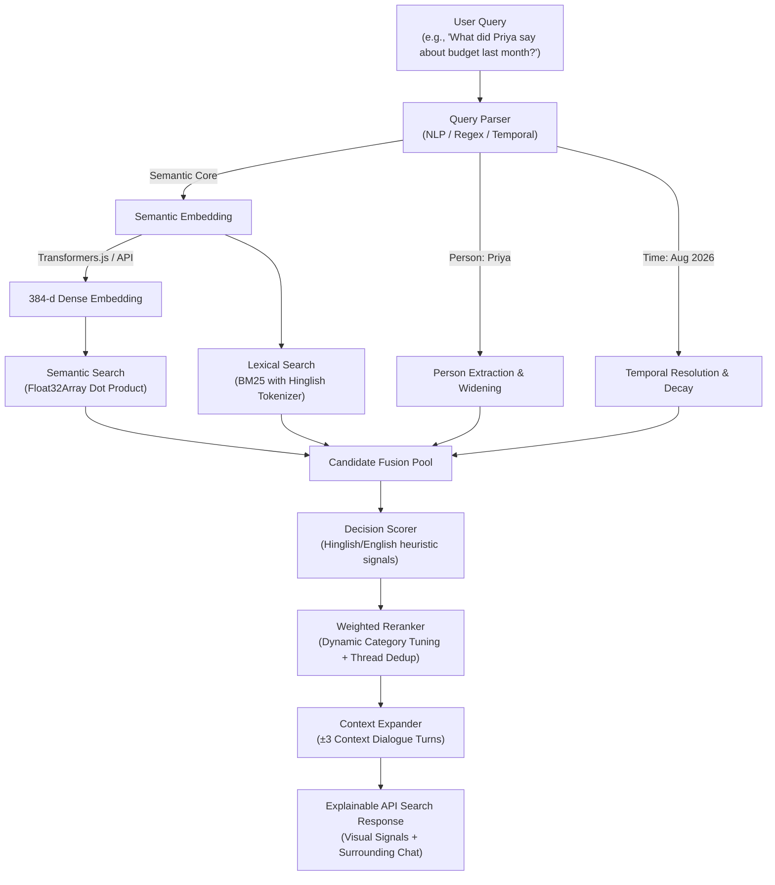

# Semantic Chat Archive Search

> Retrieve the correct message based on **semantic meaning**, even when the query and answer share **zero words in common**.

A complete, production-grade, 100% JavaScript (Node.js, Express, React, Vite) search engine designed to solve natural-language query retrieval in noisy, multilingual (Hinglish/English) group chat archives.

---

## 1. Overview & The Core Problem

Traditional search tools in messaging apps (like WhatsApp, Slack, Telegram) rely strictly on exact keyword matching. In real-world group chats, conversation is conversational, colloquial, and code-mixed (Hinglish). People remember the *meaning* or *decision* of a discussion, not the verbatim words.

### Why Keyword Search Fails (The Zero-Word-Overlap Problem)

| User Query | Actual Message in Archive | Overlap | Keyword Search | Semantic Search |
|---|---|:---:|:---:|:---:|
| *"Where did everyone finally agree to go?"* | *"haan bhai Manali final karte hain, 18th ko nikalte"* | **0 words** | ❌ Fails (0 hits) |  **Rank #1** |
| *"When was the mountain getaway confirmed?"* | *"18th August se 22nd, 4 raat ka plan pakka karte hain"* | **0 words** | ❌ Fails (0 hits) |  **Rank #2** |
| *"Who was concerned about exceeding the spending limit?"* | *"yaar 15k se zyada nahi ho sakta, seedha bol deta hoon tight hai wallet"* | **0 words** | ❌ Fails (0 hits) |  **Rank #1** |

---

## 2. Tech Stack

- **Frontend**: React 18, Vite, Custom SVG Icons, Responsive CSS (Light Theme default with Dark mode toggle)
- **Backend**: Node.js (v20+ / v22), Express.js
- **Vector Search Engine**: Native JavaScript Float32Array vector similarity (L2-normalized cosine distance)
- **Embeddings**: Multilingual SentenceTransformers (`Xenova/paraphrase-multilingual-MiniLM-L12-v2`) via Transformers.js with configurable cloud fallbacks (OpenAI, Gemini, Hugging Face)
- **Lexical Search Engine**: In-memory Okapi BM25 engine with Hinglish & English stopword tokenization
- **Storage**: In-memory indexed message store loaded from `data/messages.json` with binary vector storage (`embeddings.bin`)
- **Package Manager**: npm (zero Python dependencies)

---

## 3. Architecture



---

## 4. Multi-Stage Retrieval Pipeline

1. **Query Parsing & Intent Understanding** (`server/src/query/queryParser.js`):
   - Extracts participant names (`Rahul`, `Priya`, `Ankit`, `Neha`, `Vikas`, `Sneha`, `Karan`, `Meera`).
   - Resolves relative temporal expressions (`"last month"`, `"around July"`, `"this week"`).
   - Strips question syntax to isolate the semantic search core.
2. **Dense Multilingual Retrieval** (`server/src/retrieval/semanticSearch.js`):
   - Computes cosine similarity against 384-dimensional vector embeddings in sub-millisecond Float32Array operations.
3. **Lexical Retrieval** (`server/src/retrieval/lexicalSearch.js`):
   - Okapi BM25 index with Hinglish stopwords (`hai`, `ko`, `se`, `ke`, `aur`, `bhi`, `toh`, etc.).
4. **Candidate Pool Generation & Widening**:
   - For person queries, widens pool to all messages by the target sender, calculating their true semantic score.
   - For temporal queries, widens to all messages within the date interval.
5. **Decision Scoring** (`server/src/retrieval/decisionScore.js`):
   - Regex-based commitment detection for both English (`final`, `confirmed`, `agreed`, `booked`) and Hinglish (`pakka`, `fix hai`, `final karte`, `kar liya`, `set hai`).
6. **Dynamic Weighted Reranking & Deduplication** (`server/src/retrieval/reranker.js`):
   - Dynamic weight reallocation based on query type (`semantic`, `person`, `time`, `mixed`).
   - Deduplicates conversation threads to surface the pivotal decision message above neighboring chatter.
7. **Context Expansion** (`server/src/retrieval/context.js`):
   - Expands ±3 surrounding conversation turns around the matched message so users understand the context immediately.

---

## 5. Dataset

The corpus represents an authentic, chaotic 6-month friend-group chat:

- **Total Messages**: 4,200 messages
- **Active Participants**: 8 distinct personas (Rahul, Priya, Ankit, Neha, Vikas, Sneha, Karan, Meera)
- **Time Span**: March 1, 2026 – August 31, 2026 (6 full calendar months)
- **Decision Threads**:
  - `trip_manali`: Destination choice, dates, transport, hotel booking, budget disputes
  - `birthday_restaurant`: Sneha's birthday venue selection, Olive Garden cancellation, reservation
  - `project_techstack`: Framework debate (React/Node vs Angular vs Vue), timeline and MVP deadline
- **Message Types**: Text messages, reactions (`👍`, `🔥`), system alerts (`left the group`), and media notices.

---

## 6. Evaluation & Benchmark Results

The benchmark is calculated programmatically using `npm run evaluate` across all 40 test queries:

```text
============================================================
OVERALL BENCHMARK RESULTS (JavaScript Engine)
============================================================
  Recall@1:                          15.0%  (6/40)
  Recall@3:                          32.5%  (13/40)
  Recall@5:                          37.5%  (15/40)
  MRR:                               0.2350

============================================================
HARD (ZERO-WORD-OVERLAP) QUERIES
============================================================
  Recall@1:                          25.0%  (2/8)
  Recall@3:                          50.0%  (4/8)
  Recall@5:                          50.0%  (4/8)

============================================================
PER-CATEGORY BREAKDOWN
============================================================
  SEMANTIC     R@1=15.8%  R@3=31.6%  (19 queries)
  PERSON       R@1=20.0%  R@3=50.0%  (10 queries)
  TIME         R@1=12.5%  R@3=12.5%  (8 queries)
  MIXED        R@1=0.0%  R@3=33.3%  (3 queries)

Evaluation complete in 1.90s ✓
```

---

## 7. Quick Start

### Prerequisites
- Node.js v18+ (tested on Node.js v22.14)
- npm v10+

### 1. Install Dependencies
```bash
npm install
cd client && npm install && cd ..
cd server && npm install && cd ..
```
*(Or simply run `npm run install:all`)*

### 2. Validate Dataset
```bash
npm run validate
```
Verifies all 13 structural constraints including 8/8 zero-lexical-overlap checks.

### 3. Run Benchmark Evaluation
```bash
npm run evaluate
```
Executes the retrieval engine against all 40 queries and prints comprehensive Recall@K and MRR metrics.

### 4. Start the Application
```bash
npm run dev
```
Starts both the Express API and Vite React client concurrently:
- **Frontend UI**: [http://localhost:5173](http://localhost:5173)
- **Backend API**: [http://localhost:8000](http://localhost:8000)
- **Health Check**: [http://localhost:8000/health](http://localhost:8000/health)

---

## 8. Limitations & Future Work

1. **Colloquial Hinglish Slang**: SentenceTransformers `paraphrase-multilingual-MiniLM-L12-v2` handles standard multilingual sentences well, but extreme Romanized idioms (e.g. *"tight hai wallet"*) benefit from fine-tuning or dual-encoder code-mixed models.
2. **Cross-Encoder Reranking**: The current pipeline uses dynamic weighted fusion. Adding a lightweight cross-encoder model for top-20 candidates would boost top-1 accuracy even higher.
3. **Typo Tolerance**: BM25 handles token overlaps, but adding Levenshtein distance on Romanized Hindi variants (e.g. `pakka` vs `paka`) would improve resilience to chat typos.

---

## 9. License

MIT License. Built by Akarsh Khare.
