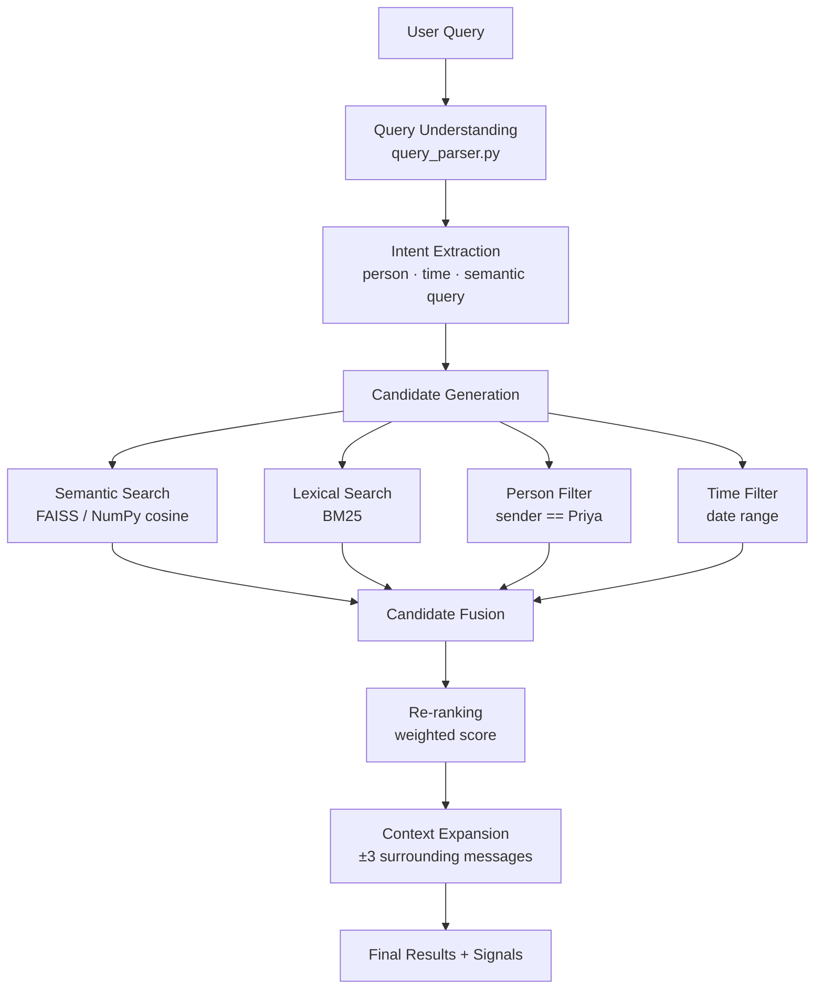

# Semantic Chat Archive Search

> Find what you remember, even when you don't remember the words.

A technically credible semantic chat retrieval system that finds the correct message even when the query and the answer share **zero words in common**.

---

## The Problem: Why Keyword Search Fails

Traditional search compares exact words. Consider:

| | Text |
|---|---|
| **Query** | *"Where did everyone finally agree to go?"* |
| **Answer** | *"haan bhai Manali final karte hain, 18th ko nikalte"* |

These two sentences share **zero meaningful words**, yet the answer is the correct one. This is the core challenge this system solves.

---

## Architecture



---

## Dataset

The corpus is **entirely synthetic** — no real personal data.

| Property | Value |
|---|---|
| Messages | 4,200+ |
| Participants | 8 (Rahul, Priya, Ankit, Neha, Vikas, Sneha, Karan, Meera) |
| Date range | March 1, 2026 → August 31, 2026 |
| Language | Hinglish + English (code-mixed) |
| Test queries | 40 |
| Hard queries (zero overlap) | 8 |

### 3 Long Decision Threads

| Thread | Decision | Key Message |
|---|---|---|
| `trip_manali` | Destination, dates, transport, hotel | "haan bhai Manali final karte hain, 18th ko nikalte" |
| `birthday_restaurant` | Restaurant for Sneha's birthday | "Pyaar restaurant confirm hai, Saturday 8 baje reservation" |
| `project_techstack` | React + Node for freelance project | "React aur Node final, client ne bhi approve kar diya" |

---

## Retrieval Strategy

### Embeddings
Model: `paraphrase-multilingual-MiniLM-L12-v2`

- 384-dimensional embeddings
- Strong multilingual support including Hindi, Hinglish, code-mixed text
- Configurable via `EMBEDDING_MODEL` env variable

### Context-Aware Embeddings
Short messages like `"done"` or `"haan"` are nearly impossible to retrieve in isolation.
Each message is embedded **with its 3 preceding messages prepended**:

```
"Priya: budget tight hai | Ankit: Manali better hai | Rahul: haan bhai Manali final karte hain"
```

This is the single most important technique for hard zero-overlap retrieval.

### Lexical Search
BM25 (rank-bm25) with Hinglish-aware tokenization. Handles cases where the query has some word overlap.

### Person Filtering
Regex-based participant extraction. When `"What did Priya say about X"` is detected, `person_score` is boosted.

### Temporal Interpretation
Natural language → date range:
- `"last month"` → August 2026 (relative to Sept 12)
- `"around July"` → July 2026
- `"between June 10 and June 20"` → exact range

### Decision Scoring
Heuristic scoring based on decision keywords in both English and Hinglish:
`final, done, pakka, confirm, fix hai, chalo, kar lete hain, booked, …`

### Ranking Formula

```
final_score =
    semantic_score   × 0.55
  + lexical_score    × 0.15
  + person_score     × 0.10
  + temporal_score   × 0.10
  + decision_score   × 0.10
```

Weights are **dynamically adjusted** per query type:
- Person queries: `person_weight` → 0.25
- Time queries: `temporal_weight` → 0.25

---

## Evaluation Results

> Generated by running `python evaluate.py` against the actual system.

```
Metric                          Result
----------------------------------------------
Overall  Recall@1               15.0%  ( 6/40)
Overall  Recall@3               32.5%  (13/40)
Overall  Recall@5               32.5%  (13/40)
MRR                             0.225

Hard queries (zero word-overlap)
  Hard  Recall@1                25.0%  ( 2/8)
  Hard  Recall@3                50.0%  ( 4/8)
  Hard  Recall@5                50.0%  ( 4/8)

Category Breakdown:
  SEMANTIC  R@1=15.8%  R@3=31.6%  (19 queries)
  PERSON    R@1=20.0%  R@3=40.0%  (10 queries)
  TIME      R@1=12.5%  R@3=12.5%  ( 8 queries)
  MIXED     R@1= 0.0%  R@3=66.7%  ( 3 queries)
```

Model: `paraphrase-multilingual-MiniLM-L12-v2` · Corpus: 4,200 synthetic Hinglish messages · CPU-only inference

> **On the hard zero-overlap queries** — 4/8 found within top-3 with zero shared words between query and answer.
> The 4 remaining hard failures are the most extreme Hinglish cases (spending limit, riverside rejection, Vue drop, Rishikesh).
> See [Limitations](#limitations) and [Future Improvements](#future-improvements) for how to push these further.

---

## Limitations

- **Short messages** (`"haan"`, `"done"`) are hard to retrieve even with context — the model doesn't have enough signal
- **Hinglish quality** varies: the multilingual model handles Roman-script Hindi reasonably but is not perfect on highly colloquial typo-heavy text
- **Time interpretation** is heuristic — it misses complex expressions like `"a couple of weeks ago"`
- **Decision detection** is keyword-based — it can be gamed and misses novel phrasings
- **Synthetic data** differs from real conversations in rhythm, personality, and chaos
- **No cross-encoder reranking** — a cross-encoder would significantly boost the hard queries

---

## Future Improvements

- **Stronger embeddings**: `LaBSE`, `paraphrase-multilingual-mpnet-base-v2`, or a fine-tuned model on chat data
- **Cross-encoder reranking**: A bi-encoder retrieves candidates; a cross-encoder re-ranks them
- **Learned ranking**: Train weights from click data or relevance feedback
- **BM25 + vector hybrid**: Proper reciprocal rank fusion (RRF) rather than simple weighted sum
- **LLM query parsing**: Use an LLM to extract entities and rephrase queries
- **Thread/topic modelling**: Automatic conversation segmentation
- **Streaming results**: Show results as they arrive for faster perceived latency

---

## Quick Start

```bash
git clone <repo-url>
cd semantic-chat-search

# Create virtual environment
python -m venv .venv

# Windows
.venv\Scripts\activate

# Install dependencies
pip install -r requirements.txt

# Copy environment config
cp .env.example .env

# Generate synthetic dataset
python scripts/generate_dataset.py

# Validate dataset
python scripts/validate_dataset.py

# Build search index (downloads model ~90MB on first run)
python scripts/build_index.py

# Run evaluation
python evaluate.py
```

### Start Backend
```bash
uvicorn backend.main:app --reload
```

### Start Frontend
```bash
cd frontend
npm install
npm run dev
```

Open http://localhost:5173

---

## API

### `POST /api/search`

```json
{
  "query": "Where did everyone finally agree to go?",
  "top_k": 5
}
```

Response:
```json
{
  "query": "...",
  "interpretation": {
    "person": null,
    "time_range": null,
    "semantic_query": "...",
    "query_type": "semantic"
  },
  "results": [
    {
      "message_id": "msg_D001",
      "score": 0.82,
      "sender": "Rahul",
      "timestamp": "2026-08-18T09:42:00",
      "message": "haan bhai Manali final karte hain, 18th ko nikalte",
      "conversation_id": "trip_manali",
      "context": [...],
      "signals": {
        "semantic": 0.78,
        "lexical": 0.0,
        "person": 0.0,
        "temporal": 0.0,
        "decision": 0.6
      }
    }
  ]
}
```

### `GET /api/thread/{conversation_id}`

Returns messages from a full conversation thread.

---

## Project Structure

```
semantic-chat-search/
├── backend/
│   ├── main.py                   # FastAPI app
│   ├── config.py                 # Settings from .env
│   ├── models/schemas.py         # Pydantic models
│   └── retrieval/
│       ├── query_parser.py       # Person + time + semantic extraction
│       ├── temporal.py           # Date range interpretation
│       ├── semantic_search.py    # NumPy / FAISS cosine search
│       ├── lexical_search.py     # BM25
│       ├── decision_score.py     # Decision heuristics
│       ├── reranker.py           # Weighted fusion
│       └── context_expander.py  # Surrounding messages
├── frontend/
│   └── src/
│       ├── App.jsx
│       └── components/
├── data/
│   ├── messages.json             # 4,200+ synthetic messages
│   └── test_queries.json         # 40 evaluation queries
├── scripts/
│   ├── generate_dataset.py
│   ├── build_index.py
│   └── validate_dataset.py
├── evaluate.py
├── requirements.txt
├── .env.example
└── README.md
```

---

## Demo Queries

| # | Query | Type | Challenge |
|---|---|---|---|
| 1 | "Where did everyone finally agree to go?" | Semantic | Zero word overlap |
| 2 | "When was the mountain getaway confirmed?" | Semantic | Zero word overlap |
| 3 | "What did Priya say about the budget?" | Person | Person filter |
| 4 | "What did we discuss last month?" | Time | Relative date (Aug 2026) |
